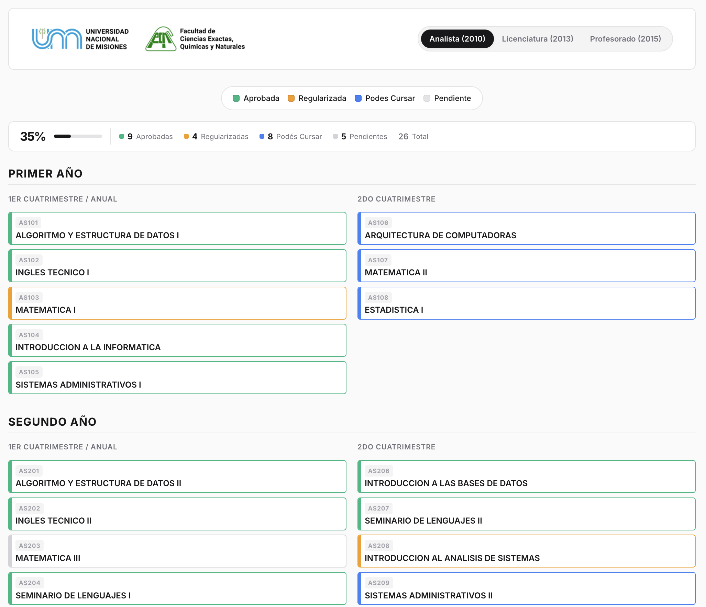
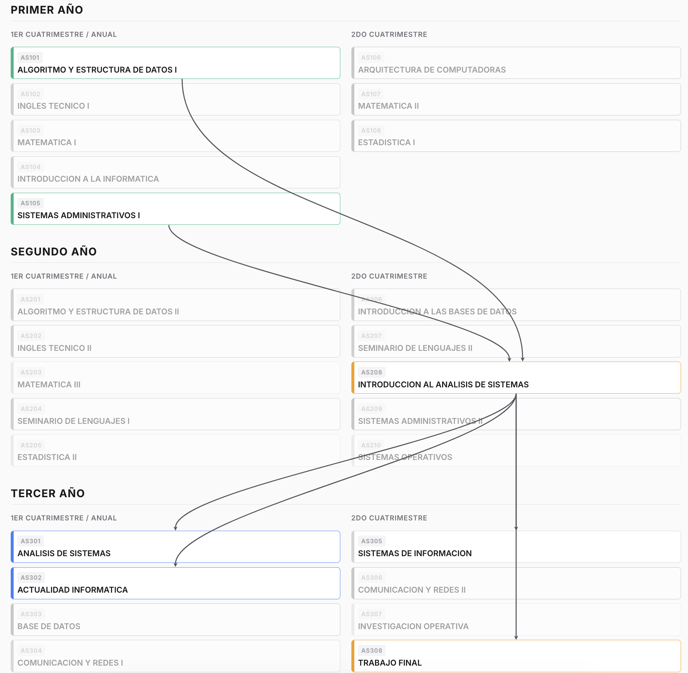

# Plan de Estudio FCEQYN - UNAM

Aplicación web interactiva para visualizar y trackear el progreso en los planes de estudio de la Facultad de Ciencias Exactas, Químicas y Naturales (UNAM).

| | |
|:-:|:-:|
|  |  |

## Carreras disponibles

- **Analista en Sistemas de Computación** (Plan 2010)
- **Licenciatura en Sistemas de Información** (Plan 2013)
- **Profesorado Universitario en Computación** (Plan 2015)

## Funcionalidades

- **Click izquierdo** → Cicla el estado de una materia: `Pendiente → Regularizada → Aprobada`
- **Click derecho** → Muestra las flechas de correlatividades entre materias
- **"Podés Cursar"** se activa cuando cumplís todos los requisitos de una materia
- Progreso y estadísticas en tiempo real
- Estado guardado en `localStorage` (persiste entre sesiones)
