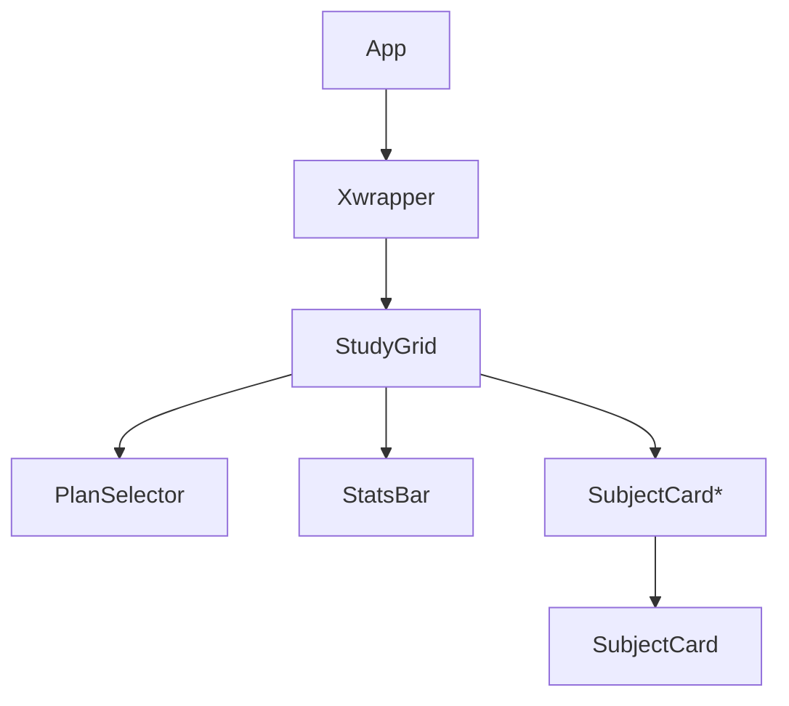

# Módulo 5: App — Root Orchestrator

> **Archivo**: `src/App.jsx`
> **Responsabilidad**: Orquestar todos los módulos, conectar datos con estado y UI, y definir el layout raíz.

---

## 1. Propósito

Es el punto de entrada de la aplicación después de `main.jsx`. Coordina los datos (`studyPlans`), el estado (`useSubjectStatus`), y la presentación (`StudyGrid`) dentro de un contenedor `Xwrapper` para habilitar las flechas de `react-xarrows`.

## 2. Árbol de Componentes



## 3. Estado Local (useState)

| Estado             | Tipo             | Default              | Descripción                          |
|--------------------|------------------|----------------------|--------------------------------------|
| `selectedPlanId`   | `PlanId`         | `'analista-2010'`    | Plan actualmente seleccionado        |
| `activeSubject`    | `Subject | null` | `null`               | Materia seleccionada para flechas    |

## 4. Flujo de Datos

### 4.1 Resolución del Plan

```js
getPlan(id):
  'analista-2010'     → studyPlans.analista
  'licenciatura-2013' → studyPlans.licenciatura
  'profesorado-2015'  → studyPlans.profesorado
  default             → studyPlans.analista
```

### 4.2 Enriquecimiento con Estado

```js
rawPlan = getPlan(selectedPlanId)
{ subjectsWithStatus, cycleStatus } = useSubjectStatus(selectedPlanId, rawPlan.subjects)
plan = { ...rawPlan, subjects: subjectsWithStatus }
```

### 4.3 Manejo de Eventos

| Evento                           | Acción                                          |
|----------------------------------|-------------------------------------------------|
| Click en StudyGrid (fuera de card)| `setActiveSubject(null)` (des seleccionar)      |
| Seleccionar plan                 | `setSelectedPlanId(id)` + `setActiveSubject(null)` |
| CycleStatus desde SubjectCard    | `cycleStatus(subjectId)` via prop               |
| SelectSubject desde SubjectCard  | `setActiveSubject(subject)` via prop            |

## 5. Layout

```html
<div className="app-container">
  <main className="main-content">
    <div className="grid-section full-width"
         onClick={click fuera de card → deseleccionar}>
      <Xwrapper>
        <StudyGrid
          plan={plan}               // Plan con estados enriquecidos
          onCycleStatus={cycleStatus}  // Handler de ciclo
          activeSubject={activeSubject}  // Selección para flechas
          onSelectSubject={setActiveSubject}  // Setter de selección
          selectedPlanId={selectedPlanId}  // Plan activo
          onSelectPlan={handlePlanChange}  // Cambio de plan
        />
      </Xwrapper>
    </div>
  </main>
</div>
```

## 6. Integración con Módulos

| Módulo | Importación                        | Uso                                |
|--------|------------------------------------|------------------------------------|
| M1     | `import { studyPlans } from './data/studyPlans'` | Obtener plan por ID |
| M2     | `import { useSubjectStatus } from './hooks/useSubjectStatus'` | Estado y ciclo |
| M4     | `import StudyGrid from './components/StudyGrid'` | Renderizado principal |

## 7. Dependencias

| Librería       | Uso                               |
|----------------|-----------------------------------|
| React          | `useState`                        |
| react-xarrows  | `Xwrapper` (contenedor de flechas) |

## 8. Casos Borde

- **Cambio de plan**: resetea `activeSubject` a `null` para evitar flechas huérfanas.
- **Click fuera de cards**: el `onClick` del contenedor verifica que el target tenga la clase `study-grid-wrapper` o `study-grid` para deseleccionar.
- **Plan inválido**: `getPlan` hace fallback a `analista`.
